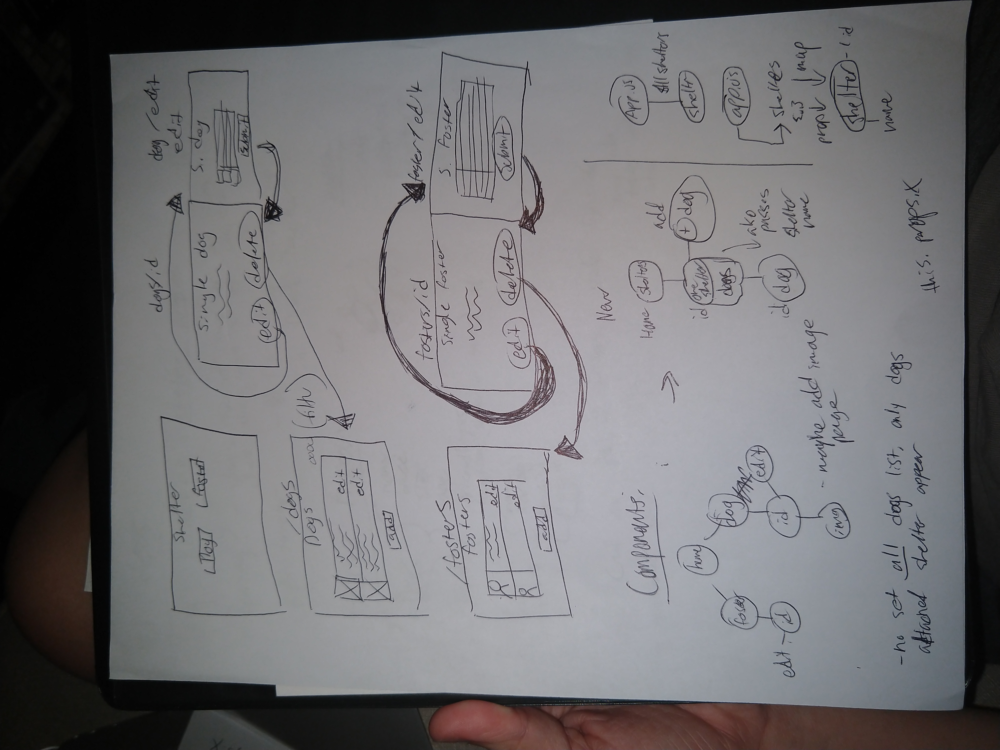
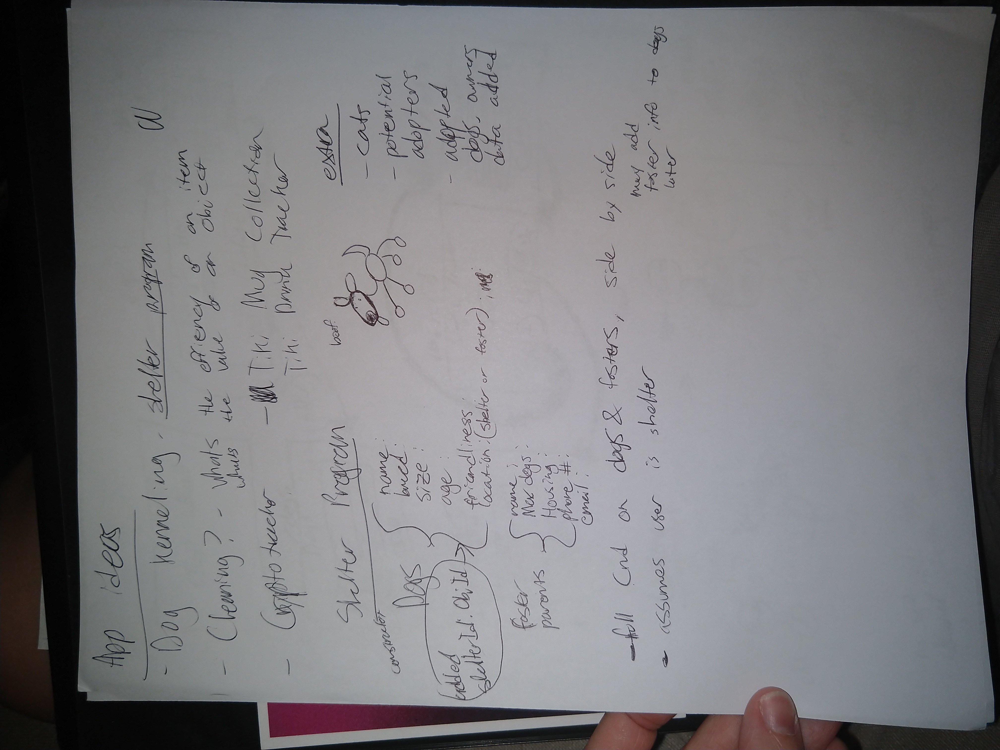

# SEI-Project-3-Shelter
## Overview

For project #3, I created a website with a remote database where users can perform CRUD on animal shelters, and the dogs within each animal shelter.

Dogs are nested with their shelter with an Object id. This made the resulting data more difficult to work with than anticipated, but not impossible. This is mostly the MVP version of the website, but I was able to add decent styling. Additions I wanted to have include having image upload for shelters and dogs, adding cats, and more descriptor fields for each object. Changing the favicon image was also a quick fix and needs to be properly recoded.

I also set my file system up incorrectly and had to reset my git repo midway through the project. This resulted in the loss of 14 commits. So while there is less than 30 commits, please add 14 to the commit number to have the true number of git commits.

**Live Site:** <https://sei-proj-3-shelter.herokuapp.com/>

## Technologies Used

  * Languages - HTML5, CSS3, Javascript, Mongo, Express, React
  * Project Planning & User Stories - [Trello](https://trello.com/b/OWwd63NF/sei-project-three)
  * Sublime Text 3

## Features

  * CRUD
  * Web Navigation

## Prework

## Future Development

  * Add cats to be viewable pets
  * Add more descriptors for shelters and dogs
  * Add image upload field   
